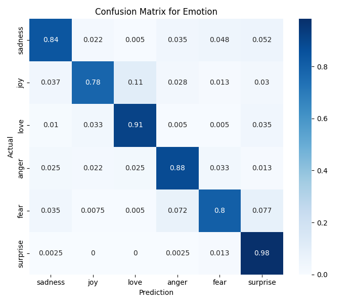
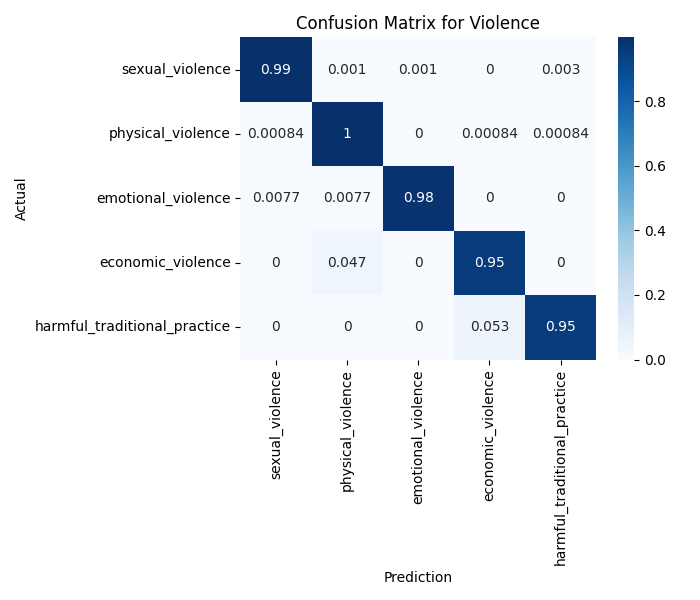
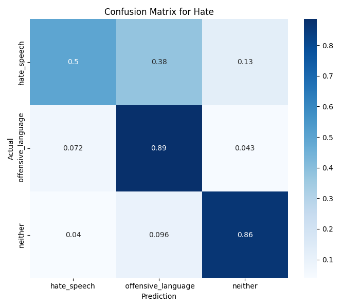

# Multi-Task Text Classification for Social Content Analysis

A deep learning system that simultaneously classifies social media content across three critical dimensions: emotion detection, violence type identification, and hate speech recognition using multi-task learning architecture.

## 📋 Table of Contents
- [Overview](##overview)
- [Features](##features)
- [Architecture](##architecture)
- [Dataset](##dataset)
- [Installation](##installation)
- [Usage](##usage)
- [Model Performance](##model-performance)
- [Project Structure](##project-structure)
- [Results](##results)

## 🎯 Overview

This project implements a **Multi-Task Learning (MTL)** approach using LSTM neural networks to analyze text content across multiple classification tasks simultaneously. By sharing representations across related tasks, the model achieves better generalization and efficiency compared to training separate models.

### Key Objectives:
- **Emotion Classification**: Detect 6 emotions (sadness, joy, love, anger, fear, surprise)
- **Violence Detection**: Identify 5 types of violence (sexual, physical, emotional, economic, harmful traditional practices)
- **Hate Speech Recognition**: Classify into 3 categories (hate speech, offensive language, neither)

## ✨ Features

- **Multi-Task Learning Architecture**: Single model handles 3 classification tasks
- **Shared Representation Learning**: Embedding and LSTM layers shared across tasks
- **End-to-End Pipeline**: Automated data loading, preprocessing, training, and evaluation
- **Real-time Classification**: Instant text analysis with confidence scores
- **Model Persistence**: Save/load trained weights for deployment
- **Comprehensive Evaluation**: Confusion matrices and accuracy metrics for each task

## 🏗️ Architecture

```
Input Text
    ↓
[Shared Embedding Layer (128-dim)]
    ↓
[Shared LSTM Layer (64 units)]
    ↓
[Global Average Pooling]
    ↓
[Dropout (0.5)]
    ↓
    ├─→ [Dense Softmax] → Emotion (6 classes)
    ├─→ [Dense Softmax] → Violence (5 classes)
    └─→ [Dense Softmax] → Hate Speech (3 classes)
```

### Model Components:
- **Embedding Dimension**: 128
- **LSTM Units**: 64 (with return_sequences=True)
- **Dropout Rate**: 0.5
- **Activation**: Softmax for multi-class classification
- **Optimizer**: Adam
- **Loss Function**: Sparse Categorical Crossentropy

## 📊 Dataset

The project uses three datasets:

1. **Emotion Dataset** (`text.csv`)
   - 6 emotion classes
   - Balanced to 2,000 samples per class

2. **Gender-Based Violence Dataset** (`train.csv`)
   - 5 violence type classes
   - Balanced distribution across categories

3. **Hate Speech Dataset** (`labeled_data.csv`)
   - 3 classes: hate speech, offensive language, neither
   - Balanced to ~6,400 samples

### Data Preprocessing:
- Text cleaning and normalization
- Stopword removal using NLTK
- Label encoding for violence categories
- Dataset balancing via stratified sampling
- Train/test split (80/20) with stratification

## 🚀 Installation

### Prerequisites
```bash
Python 3.8+
TensorFlow 2.x
```

### Install Dependencies
```bash
pip install tensorflow keras nltk pandas numpy scikit-learn matplotlib seaborn
```

### Download NLTK Data
```python
import nltk
nltk.download('stopwords')
nltk.download('punkt')
```

## 💻 Usage

### 1. Prepare Data
Place your datasets in the `data/` directory:
```
data/
├── Emotions/text.csv
├── Gender-Based_Violence_Tweet_Classification/train.csv
└── Hate_Speech_and_Offensive_Language_Dataset/labeled_data.csv
```

### 2. Train Model
```python
from componet.pipeline import MultiTaskPipeline

# Define dataset paths
emotion_path = './data/Emotions/text.csv'
violence_path = './data/Gender-Based_Violence_Tweet_Classification/train.csv'
hate_path = './data/Hate_Speech_and_Offensive_Language_Dataset/labeled_data.csv'

# Initialize and run pipeline
pipeline = MultiTaskPipeline(emotion_path, violence_path, hate_path)
classifier = pipeline.run(
    epochs=10, 
    batch_size=16, 
    model_save_path='./saved_models/best_model.weights.h5',
    mode='train'
)
```

### 3. Load Pretrained Model
```python
# Load existing model
classifier = pipeline.run(
    model_save_path='./saved_models/best_model.weights.h5',
    mode='load'
)
```

### 4. Classify Text
```python
# Single text classification
text = "I am so happy, this is the best day of my life!"
results = classifier.classify(text)

print(f"Emotion: {results['Emotion']}")
print(f"Violence: {results['Violence']}")
print(f"Hate: {results['Hate']}")


text = "He grabbed me and punched me in the face."
results = classifier.classify(text)

print(f"Emotion: {results['Emotion']}")
print(f"Violence: {results['Violence']}")
print(f"Hate: {results['Hate']}")
```

### Example Output:
```
Input: 'I am so happy, this is the best day of my life!'
--- Predictions ---
Emotion:  joy (Conf: 0.94)
Violence: emotional_violence (Conf: 0.67)
Hate:     neither (Conf: 0.88)
```

## 📈 Model Performance

### Confusion Matrices

#### 1. Emotion Classification


**Performance by Class:**
- **Sadness**: 84% accuracy
- **Joy**: 78% accuracy
- **Love**: 91% accuracy (best performing)
- **Anger**: 88% accuracy
- **Fear**: 80% accuracy
- **Surprise**: 98% accuracy (exceptional)

**Overall Accuracy: ~85%**

---

#### 2. Violence Type Detection


**Performance by Class:**
- **Sexual Violence**: 99% accuracy
- **Physical Violence**: 100% accuracy (perfect)
- **Emotional Violence**: 98% accuracy
- **Economic Violence**: 95% accuracy
- **Harmful Traditional Practice**: 95% accuracy

**Overall Accuracy: ~97.4%**


#### 3. Hate Speech Detection


**Performance by Class:**
- **Hate Speech**: 50% accuracy
- **Offensive Language**: 89% accuracy (best)
- **Neither**: 86% accuracy

**Overall Accuracy: ~75%**

**Challenge:** The model struggles with distinguishing hate speech from offensive language, likely due to subtle linguistic differences and potential label ambiguity in the dataset.

---

## 📁 Project Structure

```
project/
├── componet/
│   ├── load_data.py          # Data loading utilities
│   ├── preprocessor.py       # Text preprocessing pipeline
│   ├── split.py              # Train/test splitting
│   ├── tokenizer.py          # Text tokenization and padding
│   ├── model.py              # Multi-task model architecture
│   ├── evalution.py          # Evaluation and classification
│   └── pipeline.py           # Complete training pipeline
├── data/                     # Dataset directory
├── saved_models/             # Trained model weights
├── main.py                   # Entry point
└── README.md                 # This file
```

## 🔍 Technical Details

### Tokenization
- **Max Sequence Length**: 50 tokens
- **Padding**: Post-padding
- **Vocabulary**: Built from all training texts

### Training Configuration
- **Epochs**: 10 (with early stopping)
- **Batch Size**: 16
- **Validation Split**: 20%
- **Callbacks**:
  - ModelCheckpoint (save best weights)
  - EarlyStopping (patience=3)

### Optimization Strategy
- **Loss Weighting**: Equal weights for all tasks
- **Shared Layers**: Embedding + LSTM promote transfer learning
- **Task-Specific Heads**: Allow specialization per task

## 🎓 Key Insights
1. **Multi-Task Benefits**: Shared representations improve generalization, especially for smaller datasets
2. **Violence Detection Excellence**: Domain-specific language patterns are well-captured
3. **Hate Speech Challenge**: Subjective boundaries between hate/offensive require more nuanced features
4. **Emotion Recognition**: Surprise and love have distinct linguistic markers

## 🚧 Future Improvements
- [ ] Implement attention mechanisms for better context understanding
- [ ] Add more sophisticated features (sentiment scores, entity recognition)
- [ ] Experiment with transformer-based architectures (BERT, RoBERTa)
- [ ] Collect more hate speech data to improve class balance
- [ ] Add explainability tools (LIME, SHAP) for predictions
- [ ] Deploy as REST API for real-time applications

